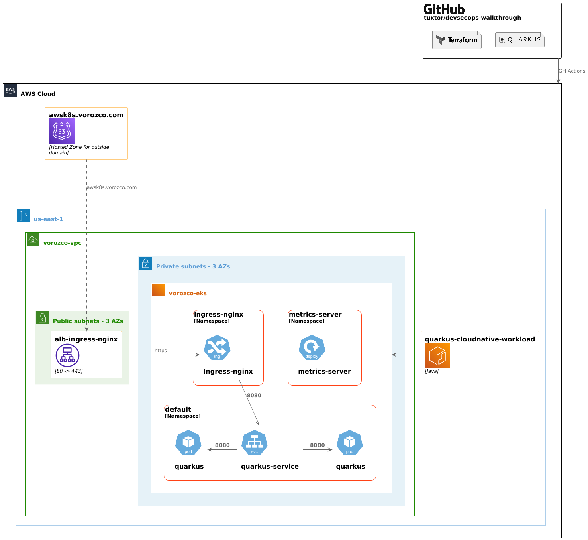

# DevSecOps Walkthrough

[](https://github.com/tuxtor/devsecops-walkthrough/actions/workflows/full-deployment.yml)



This repository is a comprehensive showcase of modern DevSecOps, cloud-native architecture, and CI/CD. Designed to demonstrate expertise in building cloud solutions on AWS. It features a fully automated infrastructure-as-code approach using OpenTofu (Terraform), with modular definitions for networking, compute, container orchestration (EKS), registry (ECR), DNS (Route53), and IAM.

The application layer leverages Java 21 and Quarkus, containerized with Docker for portability and rapid deployment.

CI/CD pipelines are implemented with GitHub Actions, ensuring automated testing, static code analysis (SpotBugs for Java, Trivy for IaC and containers), and secure dependency management via Dependabot.

Infrastructure changes are gated to the main branch, while all branches benefit from planning and testing workflows. Pull requests are reviewed with Copilot to enhance code quality and security.


## Principles and practices
- [12 Factor App: Cloud Native Principles](https://12factor.net/)
- DevSecOps
- Infrastructure as Code (IaC)
- Automated testing
- Static code analysis
- Continuous Integration and Continuous Deployment (CI/CD)

## Tools
- OpenTofu (Terraform)
- Java 21
- Quarkus
- Eclipse JKube
- AWS
- Docker (used for containerization in Quarkus workloads)
- GitHub Actions
- Static code analysis
  - (Code) [SpotBugs](https://spotbugs.github.io/)
  - (Pipelines) [Trivy](https://trivy.dev/latest/)
- Dependabot for dependency management
- Copilot for PR reviews

## Cheat sheet for demos

Configure kubectl with EKS cluster:

```bash
aws eks --region <<us-east-1>> update-kubeconfig --name <<vorozco-eks>>
```

Smoke test after deployment of the Quarkus workload:
```bash
https://awsk8s.vorozco.com/quarkus-cloud-native-workload/
```

## Slides presentation (in spanish)

[View Slides](https://github.com/tuxtor/slides/blob/master/cloud-native-devsecops/main.pdf)
